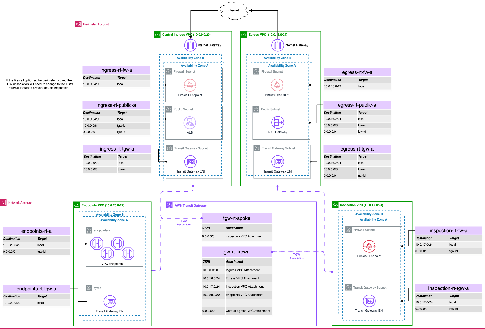
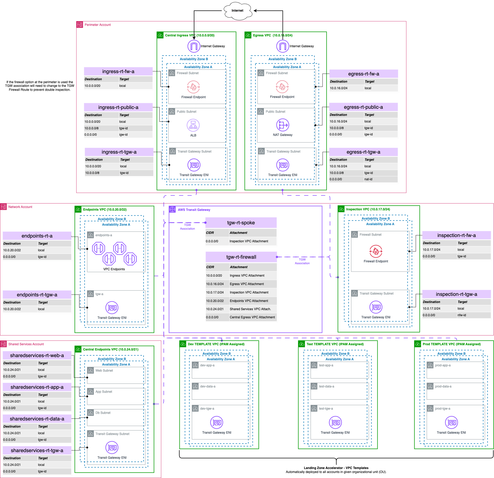
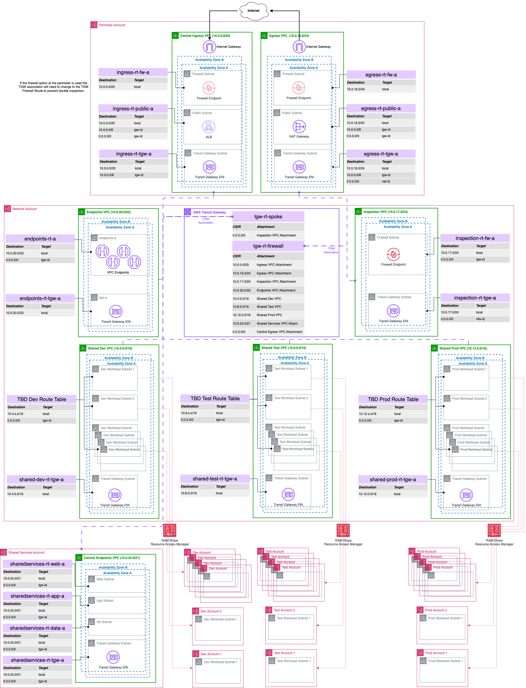

[#top]

:toc: left
:toclevels: 3
:doctype: book
:icons: font
:iconfont-remote!:
:iconfont-name: icons

= Networking Architecture

== Introduction to Landing Zone Networking

A landing zone is a well-architected, multi-account AWS environment that provides a secure foundation for deploying workloads and applications. The networking component of a landing zone is critical as it defines how resources communicate within AWS, between AWS accounts, and with external networks including the internet and your on-premises environments.

The Landing Zone Accelerator on AWS (LZA) Universal Configuration (UC) provides two networking architecture options to meet diverse organizational requirements:

* *Hub and Spoke Architecture (Default):* According to AWS Well-Architected Framework best practices, the Hub and Spoke Architecture leverages AWS Transit Gateway as a managed, scalable service that centralizes connections through a single hub, simplifying network structure and enhancing operability, scalability, and control.

* *Shared VPC Architecture (Specialized Use Case):* AWS introduces VPC sharing as a paradigm shift that allows you to decouple accounts and networks, enabling separation of duties with centrally controlled VPC structure, routing, and IP address allocation while application owners maintain control over resources and security.

Both options build on a common base network configuration but implement different approaches to workload network isolation and management.

== Business Value Proposition
The LZA Universal Configuration networking architecture delivers significant business outcomes aligned with AWS best practices:

* *Cost Optimization:* Reduces network infrastructure costs through centralized services (NAT Gateways, VPC endpoints) and elimination of redundant components across accounts, helping organizations achieve potential cost savings as confirmed by AWS

* *Security Enhancement:* Provides defense-in-depth architecture with centralized inspection capabilities, improving threat detection and security posture across your organization

* *Operational Efficiency:* Leverages standardized templates and automation to streamline network provisioning processes, reducing the "undifferentiated heavy lifting" as described in AWS documentation

* *Compliance Readiness:* Aligns with AWS best practices and multiple global compliance frameworks through built-in logging, monitoring, and traffic inspection capabilities
Business Agility: Enables rapid workload deployment while maintaining enterprise-grade security controls through automated provisioning

=== Strategic Considerations

* *Competitive Advantage:* Cloud-native networking enables faster time-to-market for digital initiatives by providing simplified connectivity through managed services

* *Risk Mitigation:* Centralizes security controls and compliance mechanisms, helping organizations better manage and govern multi-account environments

* *Scalability Investment:* Architecture follows AWS-recommended hub-and-spoke model, supporting growth from hundreds to thousands of accounts without requiring significant redesign

* *Operational Excellence:* Reduces operational complexity through centralized management, helping network teams focus on strategic initiatives rather than routine maintenance
Cost Management: Provides improved cost visibility and control through centralized networking resources, helping organizations optimize their AWS networking spend

== Selecting the Right Network Architecture

.Architecture Selection Decision Tree

[mermaid]
....
flowchart TD
    Start(Base Network Configuration) --> Q1{IP efficiency critical?}

    Q1 -->|Manageable| HubSpoke[Hub & Spoke Architecture]
    Q1 -->|Severe| SharedVPC[Shared VPC Architecture]
    
    
    HubSpoke --> HubBenefits[✅ Clear boundaries ✅ Better for DevOps]
    SharedVPC --> SharedBenefits[✅ IP efficiency ✅ Lower complexity]
....

[cols="1,2,2", options="header"]
|===
|Business Factor |Hub & Spoke Recommendation |Shared VPC Consideration

|Business Unit Independence
|✅ Enables autonomous teams with clear boundaries
|⚠️ Creates dependencies between teams

|Regulatory Compliance
|✅ Clear audit trails and responsibility boundaries
|⚠️ Shared responsibility model complexity

|M&A Integration
|✅ Easy to onboard acquired companies
|⚠️ May requires network redesign for integration

|Innovation Velocity
|✅ Teams can innovate within security guardrails
|⚠️ Central network team becomes bottleneck

|Cost Sensitivity
|⚠️ Higher infrastructure costs per account
|✅ Lower overall infrastructure costs
|===

[TIP]
====
*Recommendation*: Choose Hub & Spoke for modern, growing organizations. Consider Shared VPC only if you have extreme IP address constraints.

Both architectures are valid according to AWS best practices; your selection should be based on your specific organizational needs.
====

== Base Network Configuration

The LZA Universal Configuration delivers a robust, enterprise-grade network foundation that transforms how organizations deploy and manage their AWS cloud infrastructure. This best-practice architecture centralizes critical network services, creating immediate operational efficiencies while establishing the security controls essential for today's regulatory environment.

By implementing this AWS-recommended design, organizations achieve dramatic cost savings through consolidated network components, enhanced security through consistent policy enforcement, and accelerated innovation through standardized deployment patterns. The architecture eliminates the traditional trade-offs between security and agility, enabling your business to scale confidently while maintaining the strict controls demanded by modern compliance frameworks.

This proven approach has enabled enterprises across industries to reduce network management overhead, accelerate new workload deployment, and establish the security foundation necessary for handling sensitive workloads in regulated industries. The base network configuration represents not just infrastructure, but a strategic advantage in your cloud transformation journey.

All networking options in the LZA Universal Configuration share this core set of networking components that establish a secure foundation. The base configuration centralizes critical network services to reduce costs, improve security, and simplify management through standardized implementation.

Key VPC components used throughout the landing zone include:

* *Subnets*: Segments of a VPC's IP address range where you place AWS resources
* *Route Tables*: Rules that determine where network traffic is directed
* *Internet Gateway*: Allows communication between resources in your VPC and the internet
* *NAT Gateway*: Enables instances in a private subnet to connect to the internet while preventing the internet from initiating connections
* *Security Groups*: Virtual firewalls that control inbound and outbound traffic at the resource level

.Base Network Configuration

{empty} +

The base network configuration provides what most customers need when starting a highly scalable multi-region, multi-account landing zone. The base components are distributed across accounts to enable separation of duties while maintaining a consistent architectural foundation.

=== Centralized Network Services

The base network architecture implements centralized services that provide several key benefits:

* *Reduced Costs*: Shared infrastructure like NAT Gateways, Network Firewall, and interface endpoints minimize duplication of resources
* *Enhanced Security*: Centralized inspection points provide consistent security controls across all workloads
* *Simplified Management*: Common network components are managed in dedicated infrastructure accounts
* *Standardized Implementation*: Consistent deployment patterns across environments
* *Optimized Data Transfer*: Reduced cross-AZ data transfer costs through strategic resource placement

These centralized network services are implemented through four key components:

==== Central Ingress

Central Ingress VPC provides a centralized entry point for all incoming traffic from the internet which is destined for your external facing applications.

* *Security enhancement*: Centralization of inbound traffic enables routing, inspection, and deep packet inspection through AWS Network Firewall and optionally through customer-deployed third-party security products
* *Simplified management*: Enables centralized management of Application Load Balancers (ALBs) for various applications deployed throughout your organization
* *Edge firewall capability*: Subnets are configured to support optional edge AWS Network Firewall deployment with separate policy management

NOTE: Application Load Balancers are not deployed by LZA for workload purposes and would need to be deployed separately.

==== Central Egress

The Central Egress VPC manages outbound internet traffic through centralized NAT Gateways. Traffic with a destination of the internet flows from the source VPC through the Transit Gateway, is inspected by the Network Firewall, and then routed through the NAT Gateways.footnote:Central_Egress[https://docs.aws.amazon.com/prescriptive-guidance/latest/transitioning-to-multiple-aws-accounts/centralized-egress.html]

* *Centralized internet access*: Provides internet access from various VPCs through a single, controlled point
* *Cost optimization*: Reduces the number of deployed NAT Gateways, potentially lowering overall costs
* *Scalability*: Supports connecting multiple VPCs to a single egress VPC, enabling a scalable network design footnote:NATGW_MultiAcct[https://docs.aws.amazon.com/whitepapers/latest/building-scalable-secure-multi-vpc-network-infrastructure/using-nat-gateway-for-centralized-egress.html]
* *High availability*: If one availability zone becomes unavailable, the Transit Gateway routes traffic through the NAT gateway in another AZ

==== Central Endpoints

The Central Endpoints VPC allows multiple accounts to access AWS services privately and securely through VPC endpoints without requiring traffic to traverse the internet or the centralized NAT Gateway.footnote:Endpoints_NoNAT[https://docs.aws.amazon.com/whitepapers/latest/building-scalable-secure-multi-vpc-network-infrastructure/centralized-access-to-vpc-private-endpoints.html]

* *Cost optimization*: Centralizing VPC endpoints reduces costs compared to deploying the same endpoints in each workload VPC
* *Enhanced security*: Enables implementation of a strong data perimeter using VPC endpoint policies footnote:Perimeter_EndpointPolicies[https://aws.amazon.com/blogs/security/establishing-a-data-perimeter-on-aws/]
* *Efficient IP address utilization*: Reduces the number of IP addresses required to access AWS services while maintaining private connectivity

==== Central Inspection

The Central Inspection VPC hosts AWS Network Firewall and provides a scalable, dedicated method for inspecting and filtering both north-south (internet) and east-west (VPC-to-VPC) traffic.

* *Centralized security*: Network Firewall is deployed with LZA-managed policies for consistent traffic filtering
* *Simplified management*: Centralized management through LZA automation makes it easier to monitor and update security configurations
* *Scalability*: AWS Network Firewall automatically scales capacity based on traffic load to maintain performance while minimizing costs footnote:NFW_Scaling[https://aws.amazon.com/network-firewall/features/#product-features#network-firewall#network-firewall-features] footnote:NFW_Scaling2[https://docs.aws.amazon.com/whitepapers/latest/building-scalable-secure-multi-vpc-network-infrastructure/using-nat-gateway-with-firewall.html#scalability-2]
* *Efficient routing*: Traffic from various VPCs and on-premises networks is efficiently routed through the inspection VPC for security filtering

=== Delegated Admin Networking Account

The Network account serves as the delegated administrator for networking services, centralizing the management of network resources across your organization. This account owns key networking infrastructure including:

* AWS Transit Gateway
* VPC Endpoint Services
* Network Firewall resources
* IPAM pools

This centralization ensures that critical network infrastructure is managed by specialized teams with appropriate expertise and permissions, while providing the necessary connectivity to workload accounts.

=== Default VPC Management

When you create a new AWS account, AWS automatically creates a default VPC in each region with predefined settings. These default VPCs are designed for quick and easy resource deployment, but they don't typically align with enterprise security requirements.

By default, the LZA configuration removes these default VPCs from all accounts for security purposes. This behavior can be customized through the `defaultVpc` configuration if specific accounts need to retain their default VPCs.

[source,yaml]
----
defaultVpc:
  delete: true  # Set to false to retain default VPCs
  excludeAccounts: []  # List accounts to exclude from default VPC deletion
----

[IMPORTANT]
====
Default VPCs have unrestricted internet access through an Internet Gateway, which may not align with your security requirements. Review your security needs before changing the default deletion behavior.
====

=== IPAM Configuration

IP address management at scale is a significant challenge for large organizations. AWS IP Address Manager (IPAM) is a service that helps you plan, track, and monitor IP addresses for your AWS workloads.

The configuration implements AWS IP Address Manager (IPAM) for hierarchical, centralized IP management:

* *Global CIDR pool*: The top-level pool for your entire organization (e.g., 10.0.0.0/8)
* *Regional pool*: Allocated from the global pool for resources in a specific AWS region
* *Purpose-specific pools*: Separated by function and environment, allocated from the regional pool

This hierarchical approach ensures organized IP space management and prevents CIDR range overlaps across your infrastructure.

[.text-center]
.IPAM Hierarchical Pool Structure
.IPAM Hierarchical Pool Structure
[mermaid]
....
graph TD
    classDef global fill:#D0E8FF,stroke:#333,stroke-width:1px;
    classDef regional fill:#D0FFD0,stroke:#333,stroke-width:1px;
    classDef purpose fill:#FFFFD0,stroke:#333,stroke-width:1px;

    global["Global Pool 10.0.0.0/8"]
    regional["Regional Pool 10.20.0.0/16"]
    ingress["Ingress 10.20.0.0/24"]
    egress["Egress 10.20.1.0/24"]
    inspection["Inspection 10.20.2.0/24"]
    endpoints["Endpoints 10.20.4.0/23"]
    shared["Shared Services 10.20.8.0/22"]
    dev["Dev Workloads 10.20.16.0/20"]
    test["Test Workloads 10.20.32.0/20"]
    prod["Prod Workloads 10.20.48.0/20"]

    global --> |Allocates| regional
    regional --> |Allocates| ingress
    regional --> |Allocates| egress
    regional --> |Allocates| inspection
    regional --> |Allocates| endpoints
    regional --> |Allocates| shared
    regional --> |Allocates| dev
    regional --> |Allocates| test
    regional --> |Allocates| prod

    class global global
    class regional regional
    class ingress purpose
    class egress purpose
    class inspection purpose
    class endpoints purpose
    class shared purpose
    class dev purpose
    class test purpose
    class prod purpose
....

[IMPORTANT]
====
The IPAM configuration uses CIDR values defined in the `replacements-config.yaml` file. When implementing this solution, you should carefully plan your IP addressing strategy to accommodate future growth:

* `GlobalCidr` - The overall CIDR block for your entire organization (e.g., 10.0.0.0/8)
* `HomeRegionRegionalCidr` - Regional allocation from your global CIDR (e.g., 10.20.0.0/16)
* Environment-specific CIDRs for different areas (ingress, egress, shared services, workloads)

Sizing these CIDR ranges appropriately is critical to avoid future renumbering efforts. Consider your anticipated growth, potential cross-region deployments, and hybrid connectivity requirements.
====

=== Core Infrastructure VPCs

Both networking models deploy a set of specialized infrastructure VPCs that form the backbone of the network architecture. Each VPC has a specific purpose in the overall design:

* *Inspection VPC*: Houses AWS Network Firewall for centralized traffic inspection of both east-west (between VPCs) and north-south (to/from internet) traffic
* *Ingress VPC*: Manages inbound traffic from the internet through internet gateways, providing a controlled entry point for external traffic
* *Egress VPC*: Controls outbound internet traffic through centralized NAT Gateways, reducing costs and providing consistent outbound traffic management
* *Endpoints VPC*: Provides centralized AWS service endpoints for private API access to AWS services without requiring internet connectivity
* *Shared Services VPC*: Hosts common services used by the entire organization, such as directory services, monitoring tools, or shared databases

Each VPC is configured with specific subnet CIDR allocations from IPAM and predefined routing tables to ensure proper traffic flow. The infrastructure VPCs are deployed with high availability across multiple Availability Zones.

[.text-center]
.Core Infrastructure VPCs and Traffic Flow
[mermaid]
....
graph TD
    internet["Internet"]
    services["AWS Services"]
    
    subgraph aws["AWS Cloud"]
        tgw["Transit Gateway <i>Central hub</i>"]
        ingress["Ingress VPC <i>Internet inbound traffic</i>"]
        inspection["Inspection VPC <i>Network Firewall</i>"]
        egress["Egress VPC <i>Internet outbound traffic</i>"]
        endpoints["Endpoints VPC <i>AWS service access</i>"]
        shared["Shared Services VPC <i>Common services</i>"]
        workloads["Workload VPCs <i>Application resources</i>"]
    end
    
    internet <-->|"Inbound traffic"| ingress
    egress <-->|"Outbound traffic"| internet
    endpoints <-->|"Private API access"| services
    
    ingress <--> tgw
    tgw <-->|"Traffic inspection"| inspection
    egress <--> tgw
    endpoints <--> tgw
    shared <--> tgw
    workloads <--> tgw
....

=== VPC Flow Logs

link:https://docs.aws.amazon.com/vpc/latest/userguide/flow-logs.html[VPC Flow Logs] is a feature that enables you to capture information about the IP traffic going to and from network interfaces in your VPC. Flow log data can be published to Amazon CloudWatch Logs or Amazon S3, and can help you with:

* Monitoring and troubleshooting network connectivity issues
* Diagnosing overly restrictive security group rules
* Providing visibility into network traffic patterns
* Supporting security analysis and compliance auditing

The LZA Universal Configuration sets up enhanced VPC Flow Logs with detailed fields for comprehensive network traffic visibility:

* Logs sent to CloudWatch Logs with 30-day retention
* Automatically forwarded to the central logging account S3 bucket for long-term retention
* Custom fields enabled for detailed traffic analysis and security monitoring

[source,yaml]
----
vpcFlowLogs:
  trafficType: ALL
  maxAggregationInterval: 600
  destinations:
    - cloud-watch-logs
  destinationsConfig:
    cloudWatchLogs:
      retentionInDays: 30
  defaultFormat: false
  customFields:
    - version
    - account-id
    - interface-id
    # Additional fields...
----
[IMPORTANT]
====
These flow logs provide valuable data for security analysis, troubleshooting, and network optimization. While logs are kept in CloudWatch for 30 days for operational use, they are also automatically forwarded to the central logging S3 bucket in the Log Archive account for long-term retention and compliance purposes. You can customize the retention period and field selection based on your specific requirements.
====

=== Transit Gateway Configuration

https://docs.aws.amazon.com/vpc/latest/tgw/what-is-transit-gateway.html[AWS Transit Gateway] is a network transit hub that you can use to interconnect your VPCs and on-premises networks. It simplifies your network architecture by acting as a cloud router - each connection is only made once. Transit Gateway provides a hub-and-spoke model for network connectivity, enabling:

* Centralized management of routing between VPCs and on-premises networks
* Simplified connectivity through a single gateway
* Enhanced security through traffic segmentation and inspection
* Bandwidth aggregation across multiple connections

In the LZA Universal Configuration, AWS Transit Gateway serves as the central hub for network connectivity and provides:

* *Centralized connectivity*: Connects all VPCs and on-premises networks through a single point
* *Simplified routing*: Reduces the number of connections needed between networks
* *Traffic control*: Directs traffic through inspection points as needed
* *Segmentation*: Isolates different types of traffic through route table associations and propagations

The Transit Gateway configuration in the LZA Universal Config implements:

* Separate route tables for different traffic patterns
* Proper propagation and association relationships between route tables and attachments
* Appliance mode on the inspection attachment for symmetric routing (ensuring both directions of a flow traverse the same path)

[IMPORTANT]
====
The Transit Gateway configuration includes critical settings that should be reviewed and potentially customized:

* **Autonomous System Number (ASN)**: The default configuration uses ASN 64512, which is suitable for most deployments. However, if you plan to integrate with existing networks through BGP, you should select an ASN that doesn't conflict with your existing environments.

[source,yaml]
----
transitGateways:
  - name: "{{ AcceleratorPrefix }}-{{ HomeRegion }}-tgw"
    account: Network
    region: "{{ HomeRegion }}"
    asn: 64512  # Modify this value if needed
----

* **Route Tables**: The Transit Gateway uses two main route tables:
** `tgw-rt-firewall` - For traffic requiring inspection
** `tgw-rt-spoke` - For routing traffic from attached VPCs

* **Sharing Configuration**: Transit Gateway resource sharing is defined through `shareTargets`, which may differ between networking models.
====

=== Hybrid Connectivity Integration

Many organizations operate in hybrid environments with resources both in AWS and in on-premises data centers. The LZA network architecture supports this hybrid connectivity through AWS Direct Connect and/or VPN connections attached to the Transit Gateway.

==== AWS Direct Connect Integration

https://docs.aws.amazon.com/directconnect/latest/UserGuide/Welcome.html[AWS Direct Connect] is a cloud service that establishes a dedicated network connection from your premises to AWS. It provides a more consistent network experience than internet-based connections, with benefits including:

* Reduced network costs for high-volume data transfer
* Increased bandwidth throughput for data-intensive applications
* More consistent network performance with less latency
* Enhanced security for sensitive data

To integrate an AWS Direct Connect connection with the Transit Gateway:

1. Establish a Direct Connect connection to AWS 
2. Create a Direct Connect Gateway
3. Create a Transit Gateway association to your Direct Connect Gateway
4. Update the Transit Gateway route tables to route traffic appropriately between your AWS VPCs and on-premises networks

[source,yaml]
----
# Example configuration addition for Direct Connect association
directConnectGateways:
  - name: "your-dcgw-name"
    account: Network
    asn: 64513  # Your chosen ASN, must be different from TGW ASN
    transitGatewayAssociations:
      - name: "your-dcgw-tgw-association"
        transitGateway:
          name: "{{ AcceleratorPrefix }}-{{ HomeRegion }}-tgw"
          account: Network
        allowedPrefixes:
          - 10.0.0.0/8  # Your on-premises CIDR blocks
----

[IMPORTANT]
====
When integrating Direct Connect, ensure that:

1. There are no overlapping CIDR ranges between your AWS and on-premises environments
2. The ASN values for your Transit Gateway and Direct Connect Gateway are unique
3. BGP prefixes are properly filtered to only advertise required routes
4. Network Firewall rules are updated to allow expected traffic patterns
====

==== VPN Integration

https://docs.aws.amazon.com/vpn/latest/s2svpn/VPC_VPN.html[AWS Site-to-Site VPN] creates an encrypted tunnel between your network and your Amazon VPCs or AWS Transit Gateway. It's useful when you need secure connectivity to AWS but don't have a Direct Connect link, or as a backup to Direct Connect. Features include:

* IPsec encryption for secure data transmission
* Redundant tunnels for high availability
* Support for static routes or dynamic routing using BGP
* Integration with Transit Gateway for simplified connectivity

To integrate a VPN connection with the Transit Gateway:

1. Create a Customer Gateway representing your on-premises VPN device
2. Establish a Site-to-Site VPN connection to the Transit Gateway
3. Configure appropriate route tables and propagation rules

[source,yaml]
----
# Example configuration addition for VPN
customerGateways:
  - name: "your-onprem-cgw"
    account: Network
    region: "{{ HomeRegion }}"
    ipAddress: "203.0.113.1"  # Your on-premises VPN endpoint IP
    asn: 65000  # Your on-premises ASN
    vpnConnections:
      - name: "your-vpn-connection"
        transitGateway:
          name: "{{ AcceleratorPrefix }}-{{ HomeRegion }}-tgw"
          account: Network
        routeTableAssociations:
          - "{{ AcceleratorPrefix }}-{{ HomeRegion }}-tgw-rt-spoke"
        routeTablePropagations:
          - "{{ AcceleratorPrefix }}-{{ HomeRegion }}-tgw-rt-firewall"
        tunnelSpecifications:
          - logging:
              logGroupName: "/aws/vpn/your-vpn-connection"
----

=== Network Firewalls

AWS Network Firewall is a managed service that makes it easy to deploy essential network protections for your VPCs. The service provides stateful firewall capabilities that monitor and protect your network traffic flows.

In the LZA Universal Configuration, Network Firewall provides centralized traffic inspection:

* *Deployment*: Deployed in a dedicated inspection VPC for optimal traffic routing
* *Rule Groups*: Implements stateful rule groups for traffic filtering based on Suricata-compatible rules
* *Traffic Coverage*: Configured for both east-west (VPC-to-VPC) and north-south (internet) traffic inspection
* *Logging*: Logs alerts and flow information to CloudWatch and S3 for security monitoring and auditing

[IMPORTANT]
====
The Network Firewall rules are defined in the `firewall-rules/rules.txt` file. These rules use the link:https://docs.aws.amazon.com/network-firewall/latest/developerguide/suricata-examples.html[Suricata-compatible rule format]. When customizing firewall rules, consider:

1. Testing rules in a non-production environment before applying them broadly
2. Using rule variables to make maintenance easier
3. Implementing a least-privilege approach by default (deny all, allow specific)
4. Carefully ordering rules to ensure correct traffic processing
5. Updating rules when new applications or services are deployed
====

== Hub and Spoke Architecture (Default)

https://docs.aws.amazon.com/vpc/latest/tgw/transit-gateway-centralized-router.html[Hub and Spoke] is a network design pattern where all network traffic flows through a central point (the hub) before reaching its destination. In AWS, this pattern is typically implemented using Transit Gateway as the hub, with VPCs connected to it as spokes.

This architecture provides centralized control and inspection of traffic while maintaining isolation between spoke networks, making it ideal for environments where segmentation and security are key requirements.

=== Overview

The Hub and Spoke model is the default networking option in the LZA Universal Configuration. This architecture creates a centralized transit network with dedicated infrastructure VPCs (the "hub"), connecting to workload VPCs (the "spokes") deployed in individual accounts.

.Base Network with Hub & Spoke Configuration

{empty} +

=== Key Features

* *Individual Account VPCs*: Each workload account receives its own VPC based on standardized VPC templates
* *Distributed IP Management*: IPAM pools are shared with Organizational Units (OUs), allowing accounts to allocate addresses from their environment-specific pool
* *Consistent VPC Patterns*: VPC templates ensure standardization across environments (Dev, Test, Prod)
* *Centralized Transit*: All traffic between VPCs flows through the Transit Gateway
* *Traffic Inspection*: All east-west and north-south traffic passes through the Network Firewall

=== Hub & Spoke Benefits

* *Simplified Management*: Utilizes LZA's VPC template capability to reduce overhead and provide scalable infrastructure by targeting Organizational Units (OUs)
* *Enhanced Security*: The centralized nature allows for easier implementation of security policies, and enables centralized monitoring and packet inspection while maintaining independence from application teams
* *Simplified VPC-to-VPC Communication*: Using AWS Network Firewall authorization for VPC to VPC communication can be made on a case-by-case basis, achieving effective network segmentation
* *Flexibility*: Accommodates scenarios where VPC templating may not be suitable, allowing for traditional VPC design and deployment to specific accounts as needed

=== VPC Templates

VPC templates are standardized VPC configurations that are automatically deployed to accounts based on predefined criteria. In the LZA configuration, these templates define:

* Subnet structure and CIDR allocations
* Route table configurations
* Transit Gateway attachments
* Gateway endpoint configurations
* DNS settings

VPC templates ensure consistent networking configurations across your organization while reducing the operational burden of managing individual VPC deployments.

=== Technical Implementation

The Hub and Spoke architecture is implemented through:

* *VPC Templates*: Standardized VPC configurations deployed to accounts in target OUs
* *Transit Gateway Sharing*: The Transit Gateway is shared with Infrastructure and Workload OUs
* *IPAM Pool Sharing*: IP address pools are shared with respective OUs:
  ** Development pool with Workloads/Dev OU
  ** Test pool with Workloads/Test OU
  ** Production pool with Workloads/Prod OU
* *Network Firewall*: Centralized inspection with organization-wide policy

=== Benefits

* *Strong Isolation*: Each workload account owns and manages its VPC resources
* *Clear Resource Boundaries*: Network resources align with account boundaries
* *VPC Template Scaling*: VPC templates are a scaling mechanism allowing network administrators to define and deploy VPCs based on OUs which require no additional work when adding accounts to the environment
* *Independent Scaling*: Each account can scale its VPC resources independently
* *Operational Flexibility*: Account teams have more control over their network configurations

=== Use Cases

The Hub and Spoke architecture is ideal for organizations that:

* Require strong isolation between workload teams
* Have decentralized network operations
* Need to delegate VPC-level permissions to account owners
* Operate in environments where resource ownership boundaries need to align with account boundaries
* Have varying network requirements across different workloads

[IMPORTANT]
====
The Hub and Spoke model requires careful coordination of IP address space allocation to prevent CIDR range overlaps. While the IPAM implementation helps manage this complexity, this model generally requires more IP address space than the Shared VPC approach.
====

=== Implementation Considerations

When implementing the Hub and Spoke architecture, consider:

* *Service Quotas*: Each account will have its own Transit Gateway attachment, which counts against the link:https://docs.aws.amazon.com/vpc/latest/tgw/transit-gateway-quotas.html[Transit Gateway attachment quota]
* *Network ACLs*: Each account team must manage their own NACLs, which may require governance to ensure security requirements are met
* *Security Group Management*: Distributed security group management requires strong governance or automation to maintain consistent security posture
* *IP Planning*: Requires more extensive IP planning to avoid overlaps and ensure sufficient space for each account
* *Cost Considerations*: More Transit Gateway attachments result in higher infrastructure costs

== Shared VPC Architecture (Optional)

https://docs.aws.amazon.com/vpc/latest/userguide/vpc-sharing.html[Shared VPC] is an AWS feature that allows multiple accounts to create resources using subnets in a VPC that's owned by another account. This enables centralized management of network resources while maintaining account-level separation of application resources.

Shared VPC uses https://docs.aws.amazon.com/ram/latest/userguide/what-is.html[AWS Resource Access Manager (RAM)] to share specific subnets with designated accounts. Resource Access Manager is a service that enables you to securely share AWS resources with other AWS accounts or within your AWS Organization. In the context of Shared VPC, RAM allows the VPC owner to share specific subnets with other accounts, enabling those accounts to create resources like EC2 instances, RDS databases, and Lambda functions in the shared subnets.

RAM provides fine-grained control over:
* Which resources are shared
* Which accounts have access to shared resources
* What actions participants can take with shared resources

=== Overview

The Shared VPC architecture provides an alternative networking model that centralizes workload VPCs in the Network account while sharing specific subnets with workload accounts. This approach enhances centralized network management while maintaining account-level resource isolation.

.Base Network with Shared VPC Configuration

{empty} +

=== Key Features

* *Centralized VPC Management*: All VPCs are created and managed in the Network account
* *Subnet Sharing*: Specific subnets are shared with workload accounts using AWS Resource Access Manager (RAM)
* *Environment Segmentation*: Separate shared VPCs for Dev, Test, and Prod environments
* *Common Network Controls*: Centrally managed routing, NACLs, and security policies
* *Reduced IP Address Usage*: More efficient use of IP space through shared infrastructure

=== Technical Implementation

The Shared VPC architecture is implemented through:

* *Dedicated Shared VPCs*: Three centralized VPCs (shared-dev, shared-test, shared-prod) in the Network account
* *IPAM Pool Centralization*: All IPAM pools are shared with the Network account
* *RAM Integration*: Uses AWS Resource Access Manager for subnet sharing
* *Subnet Sharing Configuration*: Individual subnets are configured with explicit shareTargets to define which accounts have access
* *Transit Gateway Scoping*: Transit Gateway is shared only with the Infrastructure OU

=== Benefits

* *Centralized Network Administration*: Network teams maintain full control of the VPC infrastructure
* *Reduced Management Overhead*: Fewer VPCs to manage across the organization
* *IP Address Efficiency*: Better utilization of IP address space
* *Cost Optimization*: Lower data transfer costs for communications between instances in the same Availability Zone
* *Simplified Connectivity*: No need to manage complex VPC peering or Transit Gateway attachments for workload VPCs
* *Segregation of Duties*: Clear separation between network infrastructure (managed by the network team) and application resources (managed by application teams)

=== Shared VPC Hub & Spoke Benefits

* *Simplified Communication*: Allows for simplified communications between teams in the same stage of the Software Development Life Cycle (SDLC) because rule modifications to Network Firewall would not be required for resources in the same VPC
* *Cost Optimization*: For cross-account or cross-subnet communications within the same VPC, the Transit Gateway and Network Firewall would not be involved in processing those requests, potentially reducing costs and latency

=== Use Cases

The Shared VPC architecture is ideal for organizations that:

* Prefer centralized network management
* Have a dedicated network team responsible for all network infrastructure
* Need to optimize IP address space utilization
* Want to minimize the number of managed VPCs
* Have workloads with common networking requirements
* Desire consistent network controls across accounts

[IMPORTANT]
====
When implementing the Shared VPC model, consider that participants sharing subnets need some level of cooperation since they share IP space and network resources. For complete isolation between participants, consider sharing different subnets for each participant account and using network ACLs for additional traffic control.
====

=== Implementation Considerations

When implementing the Shared VPC architecture, consider:

* *Resource Sharing Limitations*: link:https://docs.aws.amazon.com/vpc/latest/userguide/vpc-sharing.html#vpc-sharing-limitations[VPC Sharing has specific limitations] including:
** Only subnet owners can modify subnet attributes and settings
** Participants cannot view, modify, or delete resources belonging to other participants
** Security groups from other accounts in the same VPC can be referenced but not modified
** Some resources (e.g., interface endpoints, NAT gateways) can only be created by the subnet owner

* *Security Group Management*: Security groups are still owned and managed at the account level, which can lead to numerous security groups across accounts using the shared VPC

* *Service Quotas*: Subnet sharing counts against the link:https://docs.aws.amazon.com/general/latest/gr/aws_service_limits.html#limits_vpc[participant account's VPC resource quotas], not the owner's

* *Permissions Model*: Requires careful planning of IAM permissions to ensure the Network account can properly manage shared VPCs while participants have appropriate access to their resources

* *Network Monitoring*: Enhanced monitoring may be needed to track resource usage across participating accounts

* *Example Subnet Configuration*:
+
[source,yaml]
----
vpcs:
  - name: "my-shared-vpc"
    account: Network
    region: "{{ HomeRegion }}"
    cidrs:
      - 10.20.8.0/22
    subnets:
      - name: "shared-app-subnet-a"
        availabilityZone: a
        routeTable: "shared-app-rt"
        ipv4CidrBlock: 10.20.8.0/24
        shareTargets:
          accounts:
            - "123456789012"  # Specific account ID
            - "myAppAccount1"  # Account name from accounts-config.yaml
          organizationalUnits:
            - "Workloads/Dev"
            - "Workloads/Test"
      - name: "shared-app-subnet-b"
        availabilityZone: b
        routeTable: "shared-app-rt"
        ipv4CidrBlock: 10.20.9.0/24
        shareTargets:
          organizationalUnits:
            - "Workloads"  # Share with entire Workloads OU
----

=== Architecture Comparison Summary

The Landing Zone Accelerator on AWS provides two network architecture options, with Hub and Spoke established as the default and recommended approach for most organizations. Hub and Spoke delivers superior security isolation, clearer ownership boundaries, and enhanced operational flexibility that better aligns with modern cloud-native and multi-team environments. Here's a comparison to guide your decision:

[cols="1,3,3", options="header"]
|===
|Factor |Hub and Spoke (Recommended) |Shared VPC

|Security & Isolation
|*Enhanced security through strong account-level isolation* with separate VPCs for each account, reducing blast radius and providing clearer security boundaries
|Resources share underlying VPC infrastructure, relying on security groups and subnet-level controls for isolation

|Organizational Alignment
|*Ideal for modern cloud operating models* with distributed teams, clear ownership boundaries, and DevOps practices while maintaining central security controls
|Better suited for traditional IT models with centralized network operations and strictly controlled access patterns

|Operational Autonomy
|*Empowers application teams* to manage their network resources within guardrails, accelerating innovation while meeting security requirements
|Creates dependencies between application teams and central networking teams for subnet allocation and VPC changes

|Scalability
|*Seamlessly scales with organizational growth* through VPC templates that automatically deploy to new accounts in configured OUs
|Requires manual coordination for subnet sharing configuration when onboarding new accounts

|Governance & Compliance
|*Clearer ownership boundaries* improve accountability, auditability, and compliance posture by aligning network resources with account ownership
|Shared infrastructure can create ambiguity in responsibility boundaries and complicate compliance auditing

|Flexibility
|*Adapts well to varying needs* across different business units and application teams while maintaining consistent security controls
|Less adaptable to diverse requirements; forces conformity to centralized network design
|===

The Hub and Spoke model is recommended for most organizations as it better reflects AWS best practices for building secure, scalable, and operationally efficient multi-account environments. This model promotes clear ownership boundaries, security isolation, and operational agility while providing consistent security controls through centralized inspection and routing.

Consider the Shared VPC approach only for specific use cases where you require extreme efficiency in IP address utilization, have teams with highly interdependent resources that benefit from being in the same VPC, or operate with a strictly centralized networking team structure.

== Customizing Network Configurations

=== Working with replacements-config.yaml

Many network parameters in the configuration use variables defined in `replacements-config.yaml`. This approach allows for consistent references and simplified updates across configuration files.

To customize these values:

1. Determine your organization's IP addressing strategy
2. Update the CIDR ranges in `replacements-config.yaml` to match your requirements
3. Ensure your CIDR allocations don't overlap with existing networks, including on-premises environments
4. Adjust subnet mask lengths based on expected resource density in each subnet type
5. Commit changes to the repository and run the LZA pipeline to apply updates

[IMPORTANT]
====
Modifying CIDR ranges after initial deployment may require destroying and recreating network resources. Plan your IP addressing carefully before initial deployment to avoid disruptive changes later.
====

=== Understanding CIDR Notation

CIDR (Classless Inter-Domain Routing) notation is a standard for representing IP addresses and their subnets. It consists of an IP address followed by a forward slash and a number indicating the network prefix length.

For example, in `10.0.0.0/8`:
* `10.0.0.0` is the base IP address
* `/8` means the first 8 bits define the network portion

The smaller the number after the slash, the larger the network. Some common CIDR blocks:

* /8 - 16,777,216 IP addresses (10.0.0.0 - 10.255.255.255)
* /16 - 65,536 IP addresses (10.20.0.0 - 10.20.255.255)
* /24 - 256 IP addresses (10.20.1.0 - 10.20.1.255)
* /28 - 16 IP addresses (10.20.1.0 - 10.20.1.15)

When planning your IP address allocation, consider the expected number of resources in each subnet and leave room for growth.

=== Customizing Firewall Rules

To customize the Network Firewall rules:

1. Edit the appropriate `firewall-rules/rules.txt` file for your selected networking model
2. Use Suricata-compatible rule syntax (link:https://suricata.readthedocs.io/en/suricata-6.0.2/rules/intro.html[Suricata rule documentation])
3. Update rule variables as needed for your environment
4. Ensure all rules have unique SIDs
5. Test rules thoroughly in a non-production environment

[source]
----
# Example rule to allow traffic to a specific domain
pass tls $HOME_NET any -> $EXTERNAL_NET any (tls.sni; content:".example.com"; startswith; nocase; endswith; 
  classtype:not-suspicious; msg:"Allow traffic to example.com"; priority:1; 
  flow:to_server, established; sid:20002; rev:1;)
----

== Performance and Monitoring

=== Key Performance Indicators

==== Network Performance Metrics
Monitor these metrics for optimal network performance:

* *Transit Gateway Utilization*: Track bandwidth usage across attachments
* *Network Firewall Performance*: Monitor throughput and processing latency
* *VPC Flow Log Analysis*: Identify top talkers and traffic patterns
* *Cross-AZ Data Transfer*: Track costs and optimize placement

==== CloudWatch Dashboards

Create dashboards to monitor:
[source,json]
----
{
  "widgets": [
    {
      "type": "metric",
      "properties": {
        "metrics": [
          ["AWS/TransitGateway", "BytesIn", "TransitGateway", "tgw-xxxxxxxxx"],
          [".", "BytesOut", ".", "."],
          ["AWS/NetworkFirewall", "ReceivedPackets", "FirewallName", "inspection-firewall"],
          [".", "DroppedPackets", ".", "."]
        ],
        "period": 300,
        "stat": "Sum",
        "region": "us-east-1",
        "title": "Network Infrastructure Performance"
      }
    }
  ]
}
----

=== Automated Monitoring & Alert Setup

.security-config.yaml
[source,yaml]
----
# CloudWatch alarms for network infrastructure
cloudWatch:
  alarmSets:
    - deploymentTargets:
        accounts:
          - Network
      alarms:
        - alarmName: "TransitGateway-HighUtilization"
          alarmDescription: "Transit Gateway high packet utilization"
          metricName: "PacketsPerSecond"
          namespace: "AWS/TransitGateway"
          comparisonOperator: "GreaterThanThreshold"
          evaluationPeriods: 2
          period: 300
          statistic: "Average"
          threshold: 80
          treatMissingData: "notBreaching"
          snsTopicName: "SecurityMedium"
          
        - alarmName: "NetworkFirewall-DroppedPackets"
          alarmDescription: "Network Firewall dropping packets"
          metricName: "DroppedPackets"
          namespace: "AWS/NetworkFirewall"
          comparisonOperator: "GreaterThanThreshold"
          evaluationPeriods: 1
          period: 300
          statistic: "Sum"
          threshold: 1000
          treatMissingData: "notBreaching"
          snsTopicName: "SecurityHigh"
----

== Network Security Considerations

When implementing your landing zone network architecture, consider these key security principles:

=== Defense in Depth

* Implement multiple layers of network security controls
* Use both Network Firewall and security groups for traffic filtering
* Implement least-privilege access at each layer

=== Traffic Inspection

* Configure Network Firewall to inspect both east-west and north-south traffic
* Enable appropriate logging for security monitoring and auditing
* Regularly review and update firewall rules based on security requirements

=== Network Segmentation

* Isolate different environments (Dev, Test, Prod) with appropriate network controls
* Use NACLs for subnet-level security
* Use security groups for resource-level security

=== Access Control

* Restrict direct internet access where not required
* Use VPC endpoints for secure access to AWS services
* Implement strict controls for cross-account access

=== Monitoring and Visibility

* Enable VPC Flow Logs across all VPCs
* Set up appropriate alerting for suspicious traffic patterns
* Regularly review network traffic patterns for anomalies

== Operational Readiness

=== Suggested Day 1 Operations
After deployment, ensure these operational capabilities are in place:

* *24/7 Monitoring*: CloudWatch dashboards for network health and performance
* *Incident Response*: Runbooks for common network issues and escalation procedures
* *Change Management*: Approval processes for firewall rule changes and network modifications
* *Backup & Recovery*: Configuration backup and disaster recovery procedures

=== Suggested Ongoing Maintenance
Regular maintenance tasks include:

* *Monthly*: Review VPC Flow Logs for anomalies and optimization opportunities
* *Quarterly*: Security posture review and firewall rule audit
* *Annually*: Capacity planning review and IP address allocation assessment
* *As-needed*: Network Firewall rule updates based on new application requirements

=== Team Responsibilities
[cols="1,2,2", options="header"]
|===
|Role |Hub & Spoke Responsibilities |Shared VPC Responsibilities

|Central Network Team
|All VPC management, Transit Gateway, firewall rules, IPAM management, VPC endpoint creation
|All VPC management, Transit Gateway, firewall rules, IPAM management, VPC endpoint creation, subnet allocation, centralized security policies

|Account Teams
|Security groups, application-specific NACLs
|Security groups only, request subnet allocation & NACLs configuration through network team

|Security Team
|Network Firewall policy oversight, security group governance
|Network Firewall policy oversight, security group governance
|===

== Outstanding Considerations

When implementing either networking model, consider these important decisions:

1. *Separation of duties*: Consider how network management responsibilities will be distributed between core networking teams and other operational teams.

2. *Black hole routes*: Consider whether to implement black hole routes for additional security.footnote:NFW_blackhole[https://docs.aws.amazon.com/whitepapers/latest/building-scalable-secure-multi-vpc-network-infrastructure/centralized-network-security-for-vpc-to-vpc-and-on-premises-to-vpc-traffic.html] Note that this requires more advanced troubleshooting knowledge.

3. *Sandbox VPC internet connectivity*: Decide whether sandbox VPCs should have internet access and VPC endpoints enabled by default.

4. *AZ planning*: Determine whether VPCs should be provisioned with IP space for two or three availability zones based on your availability requirements.

== Additional Resources

For more information about AWS networking concepts used in these architectures, refer to:

* link:https://docs.aws.amazon.com/vpc/latest/userguide/what-is-amazon-vpc.html[Amazon VPC Documentation]
* link:https://docs.aws.amazon.com/vpc/latest/userguide/vpc-sharing.html[VPC Sharing Documentation]
* link:https://docs.aws.amazon.com/vpc/latest/tgw/what-is-transit-gateway.html[Transit Gateway Documentation]
* link:https://docs.aws.amazon.com/vpc/latest/ipam/what-is-it-ipam.html[IP Address Manager Documentation]
* link:https://docs.aws.amazon.com/vpc/latest/userguide/network-acls.html[Network ACLs Documentation]
* link:https://docs.aws.amazon.com/network-firewall/latest/developerguide/what-is-aws-network-firewall.html[AWS Network Firewall Documentation]
* link:https://docs.aws.amazon.com/directconnect/latest/UserGuide/Welcome.html[AWS Direct Connect Documentation]
* link:https://docs.aws.amazon.com/vpn/latest/s2svpn/VPC_VPN.html[AWS Site-to-Site VPN Documentation]
* link:https://aws.amazon.com/blogs/networking-and-content-delivery/deployment-models-for-aws-network-firewall[Deployment models for AWS Network Firewall]
* link:https://docs.aws.amazon.com/prescriptive-guidance/latest/transitioning-to-multiple-aws-accounts/centralized-egress.html[Centralized Egress Architecture]
* link:https://aws.amazon.com/blogs/security/establishing-a-data-perimeter-on-aws[Establishing a Data Perimeter on AWS]